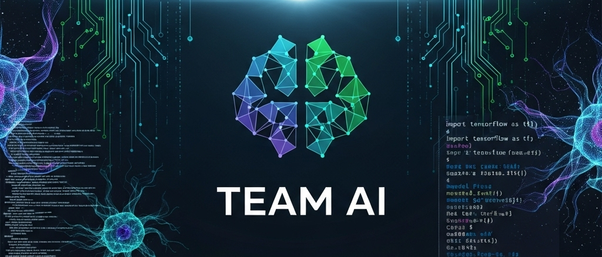

<p align="center">
  
</p>

# Team_Ai_Project
Cat &amp; Dog Segmentation Project by Team AI

# Cat & Dog Segmentation Application

## 1. Annotate Images

Use [labelme](https://github.com/wkentaro/labelme) to annotate your images:

## 2. Convert Annotations to VOC Format

Use the provided [`labelme2voc.py`](labelme2voc.py) script to convert your labelme annotations to VOC format:

```sh
python labelme2voc.py data_annotated data_dataset_voc --labels dataset/labels.txt
```

- `data_annotated`: Directory containing your labelme JSON files.
- `data_dataset_voc`: Output directory for VOC-formatted data.
- `dataset/labels.txt`: File containing your class labels.

---

## 3. Run the Application with Docker

### a. Install Docker

Follow instructions at [https://docs.docker.com/get-docker/](https://docs.docker.com/get-docker/) to install Docker for your platform.

### b. Pull the Docker Image

```sh
docker pull feniztho/cat_dog_seg_team_ai:latest
```

### c. Run the Application

```sh
docker run -p 8000:8000 feniztho/cat_dog_seg_team_ai:latest
```

---

## 4. Access the Application

Open your browser and go to:  
[http://localhost:8000](http://localhost:8000)

You will be redirected to the API documentation where you can test the segmentation endpoint.

---

## Files

- [`labelme2voc.py`](labelme2voc.py): Script to convert labelme annotations to VOC format.
- [`dataset/labels.txt`](dataset/labels.txt): List of class labels for segmentation.

---

## License

See [LICENSE](LICENSE) for details.

<p align="center">
  
</p>